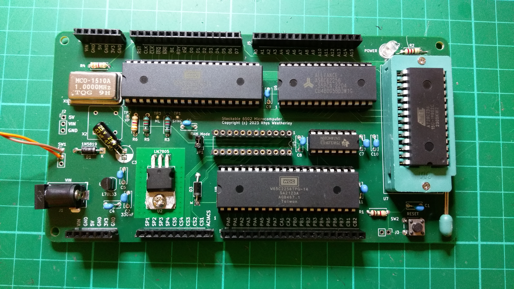
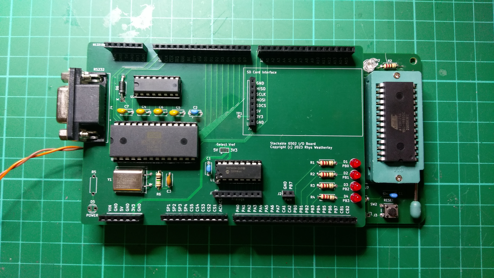

Stackable 6502 Computer
=======================

This repository contains schematics, PCB layouts, and other information
for a "stackable" design for a 6502-based computer based on
[Ben Eater's Breadboard 6502 Computer](https://eater.net/6502) with
options to expand with daughter boards (or "shields" in the Arduino sense).

The CPU, memory, VIA, and address decoding are on the base board with pin
headers to connect to other boards:

Here is the Stackable 6502 Computer with the I/O board fitted:

Other boards are possible in the future; see **Future Expansion Ideas** below.

Repository Layout
-----------------

* `kicad` - Schematics and PCB layouts in [KiCad format](https://www.kicad.org/).
* `kicad/BaseBoard` - Base board schematic and layout (4-layer).
* `kicad/IoBoard` - I/O board schematic and layout (2-layer).
* `kicad/Library` - Library of common schematic symbols and footprints.
* `schematics` - PDF versions of the schematics.
* `gerber` - Gerber files for all of the boards.
* `roms` - ROM images for test programs.
* `src` - Source code for test programs.

Schematics and Parts
--------------------

PDF versions of the schematics are available for the
[Base Board](schematics/BaseBoard.pdf) and [I/O Board](schematics/IoBoard.pdf)
in the `schematics` subdirectory.  The `gerber` directory contains the
Gerber files if you want to get your own PCB's made.

I used [PCBway](https://www.pcbway.com/) for my PCB's.  The PCB's for
the base board and I/O board are 4-layer boards.

The parts list for this project can be found in the file
[Parts.md](doc/Parts.md) in the `doc` subdirectory.  There are some
alternatives on how you can build it, so some parts are optional:

* The 1MHz crystal oscillator can use either the 14-pin DIP style package (X1)
or the 8-pin DIP style package (X2) version.  Fit only one of the oscillators.
* Address decoding can use either a simple 74LS00 NAND gate, or a
ATF22V10C-7PX Programmable Logic Device (PLD).  It is easiest to start with
the NAND gate, but the PLD provides a lot of flexibility in memory layout.
* Optional 3.3V power supply using a L78L33 3.3V voltage regulator.
This will be handy if you plan to interface to 3.3V equipment using
level conversion.
* MCP3208 12-bit SPI ADC on the I/O board for reading analog inputs.

I suggest studying the schematics and the build instructions before
deciding which options you need.

Base Board
----------

The 156mm x 82mm base board was based on the design for
[Ben Eater's Breadboard 6502 Computer](https://eater.net/6502) with some
modifications to help with expandability:

* W65C02S or pin-compatible microprocessor.
* 62256 32K x 8 static RAM.
* 28C256 32K x 8 EEPROM, mounted in a 28-pin ZIF socket at the end of the
  base board to give clearance between the socket and daughter boards.
  A regular 28-pin socket can be used instead of the ZIF if you prefer.
* 6522 Versatile Interface Adapter (VIA).
* Address decoding logic using either a 74LS00 quad NAND gate as in Ben Eater's
  original design, or a ATF22V10C-7PX programmable logic device (PLD).
* 5V and 3.3V power supplies based on a 9-12V DC input.
* Pin headers to expose power, bus lines, and control lines to the
  attached daughter boards.
* 4-layer PCB with ground and 5V on the two inner layers.

The pin headers are aligned on a strict 2.54mm (0.1 inch) grid to allow
standard 120mm x 80mm stripboard or protoboard to be used when creating
daughter board "shields".

If you want to lay out your own shield PCB, then you can use the
`Stackable6502Shield` symbol and footprint from `kicad/Library`
as a starting point.

See [Build-Base-Board.md](doc/Build-Base-Board.md) in the `doc`
subdirectory for instructions on building the base board.

I/O Board
---------

The 125 x 82mm I/O board provides the following features:

* RS-232 serial interface using the 6551 ACIA, with RTS handshaking.
* SPI bus interface, connected to the 6522 VIA on the base board.
* SD card interface, connected to the SPI bus interface.
* 8 analog inputs using the MCP3208 12-bit SPI ADC chip.
* "PWM" header for square wave output on PB7 of the 6522 VIA.
  A piezo-buzzer can be connected to the header for making simple sounds.
* Provision for 3mm LED's on PB0..PB3 for indication.

As can be seen, the I/O board is very featureful.  Not all features need
to be fitted at once.  You can customise it for your requirements.

See [Build-Io-Board.md](doc/Build-Io-Board.md) in the `doc`
subdirectory for instructions on building the I/O board.

Future Expansion Ideas
----------------------

I'd like to design a memory expansion board with large amounts of
bank-switched RAM.  The ATF22V10C-7PX PLD can help with this, redirecting
memory requests away from the standard RAM to the additional banks.

SPI-based NAND or NOR flash chip for long term storage.  The contents of
flash could be loaded into the bank-switched RAM at startup to provide
ROM replacement capabilities.

An interface to an SPI-based Arduino LCD or OLED module may be interesting.

An alternative serial interface using a FTDI chip for serial over USB.

Address Decoding
----------------

The 74LS00 quad NAND gate on the base board implements the same memory
map as Ben Eater's original design:

* `0x0000 - 0x3FFF` - 16K of static RAM
* `0x4000 - 0x4FFF` - Unused
* `0x5000 - 0x5FFF` - ACIA
* `0x6000 - 0x6FFF` - VIA
* `0x7000 - 0x7FFF` - Do not use due to conflicts between the ACIA and VIA
* `0x8000 - 0xFFFF` - 32K of EEPROM

This arrangement is very wasteful of address space, particularly the
static RAM, but is very simple.  More complex arrangements require more
logic gates.

The ATF22V10C-7PX PLD provides greater flexibility in allocating address
ranges.  The PLD can be programmed to allocate the memory map in almost
any way, and to provide additional chip select outputs for devices on
daughter boards.  Addresses can be mapped with 64-byte granularity.

Note: I am still working on the PLD code.  More later.

License
-------

Stackable 6502 Computer by Rhys Weatherley is licensed under <a href="http://creativecommons.org/licenses/by-nc-sa/4.0/?ref=chooser-v1" target="_blank" rel="license noopener noreferrer" style="display:inline-block;">Attribution-NonCommercial-ShareAlike 4.0 International</a>

Contact
-------

For more information on this project, to report bugs, or to suggest
improvements, please contact the author Rhys Weatherley via
[email](mailto:rhys.weatherley@gmail.com).
