Building the Base Board of the Stackable 6502 Computer
======================================================

See the [Parts.md](Parts.md) file for a list of parts.  It is assumed that
you are familiar with soldering through hole parts.  There are no surface
mount parts in the Base Board.  Sockets are recommended for the chips
as there will be a lot of handling while soldering up all the components.

Some of the components are marked on the schematic; e.g. U1 is L78L33,
but others aren't marked.  I got lazier the longer I worked on the PCB layout.
Sorry.

The PDF of the Base Board schematic can be found [here](../schematics/BaseBoard.pdf).

The following 3D rendering from KiCad shows the location of the major
components:

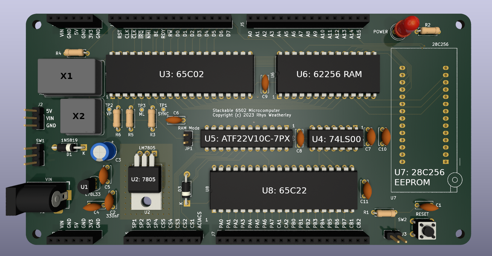

Here are all of the steps if you want to skip ahead:

* [Step 1: Resistors](#step-1)
* [Step 2: Diodes](#step-2)
* [Step 3: IC Sockets](#step-3)
* [Step 4: Crystal Oscillator](#step-4)
* [Step 5: Ceramic Capacitors](#step-5)
* [Step 6: Power Supply](#step-6)
* [Step 7: Smoke Test!](#step-7)
* [Step 8: EEPROM Socket](#step-8)
* [Step 9: Fit the chips](#step-9)
* [Step 10: Fit the pin headers](#step-10)
* [Step 11: Testing and troubleshooting](#step-11)

<a name="step-1"/>
Step 1: Resistors
-----------------

As with all through hole projects, start with the low profile resistors:

* R1 - 1K
* R2 - 220R (see the note below)
* R3 - 10K
* R4 - 3.3K
* R5 - 10K
* R6 - 3.3K

R2 is the current-limiting resistor for the power LED (D2).  The value of
this resistor will depend upon the current rating of your LED.  220R is
suitable for simple red/green LED's rated for 15mA to 20mA.  Increase the
resistance for LED's with lower current ratings.

1K should be safe for most LED types but it may be dim.  I actually started
with 1K but my LED was too dim so I changed it to 220R later in the build.

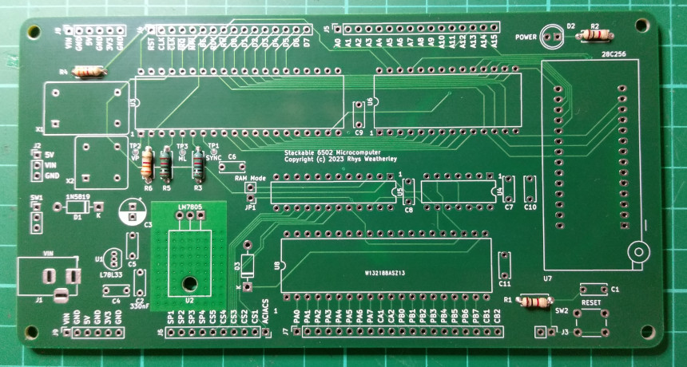

<a name="step-2"/>
Step 2: Diodes
--------------

Fit the two Schottky diodes (D1 and D3).  Almost any Schottky should do:
1N5819 or SB140 or equivalent.  Make sure the diodes are oriented the
right way around.

D1 should be rated for 1A or more as it delivers power to the entire base
board and any daughter boards.  The LM7805 voltage regulator U2 is also
rated for 1A, so you can't go over 1A unless you replace both D1 and U2
with higher-spec'ed components.

Another option for high power operation is to bypass the on-board power
supply entirely and feed 5V in via J2 from an external power supply.

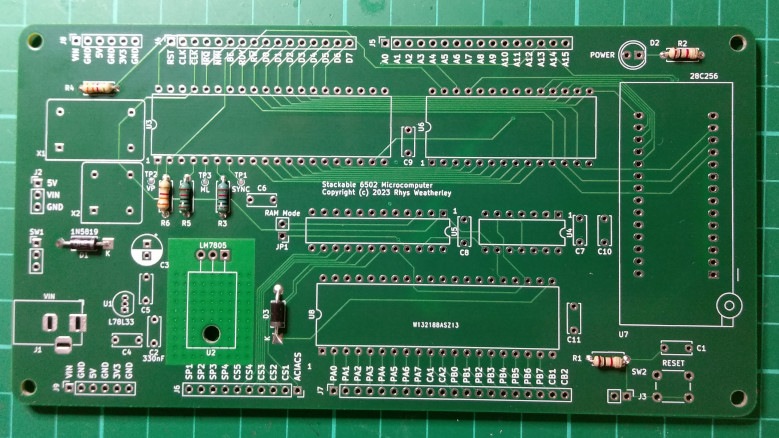

<a name="step-3"/>
Step 3: IC Sockets
------------------

Next it is time for the IC sockets:

* U3 - 40-pin DIP socket - 65C02 microprocessor.
* U4 - 14-pin DIP socket - 74LS00 NAND gate.
* U5 - 24-pin DIP socket - ATF22V10C-7PX Programmable Logic Device (optional).
* U6 - 28-pin DIP socket - 62256 32K static RAM.
* U8 - 40-pin DIP socket - 65C22 Versatile Interface Adapter (VIA).

In this step I have not yet fitted the socket for U7 (28C256 EEPROM) as I
will be fitting a 28-pin ZIF socket later.  But if you don't want to use a
ZIF socket, then you can fit a plain 28-pin socket for U7 in this step.

If you prefer to solder your chips down without IC sockets, then you should
still use sockets for U5 and U7.  Otherwise you won't be able to remove the
ATF22V10C-7PX PLD and 28C256 EEPROM from the board to reprogram them later!

<b>Note:</b> U4 and U5 are oriented with the notch and pin 1 facing right
instead of the usual left for all other chips.  This made it easier to route
the PCB.  Make sure you orient the sockets correctly to remind you which
direction to insert the chips later.

I like to hold the sockets in position with masking tape while soldering
the first few pins:

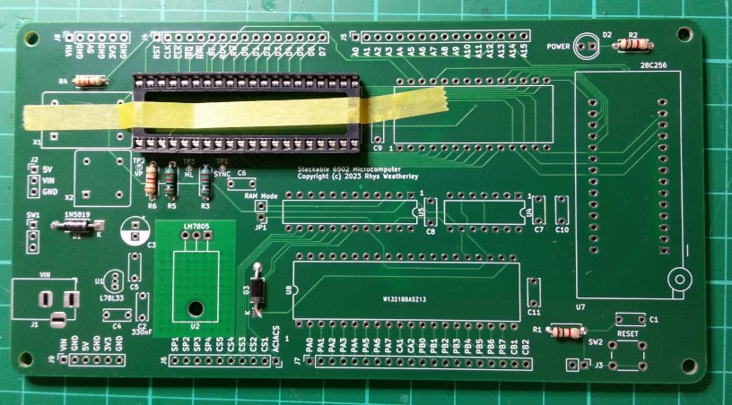

Afterwards, the board should look like the picture below.  This configuration
is for when using the 74LS00 NAND gate for address decoding (U5 not fitted).

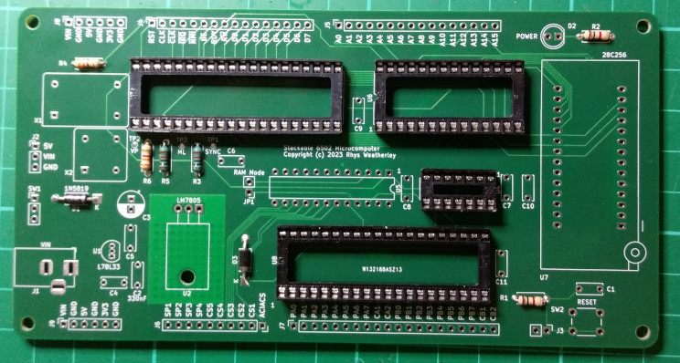

<a name="step-4"/>
Step 4: Crystal Oscillator
--------------------------

Next fit the 1MHz crystal oscillator module.  The PCB has provision for
either the 14-pin DIP sized package (X1) or the 8-pin DIP sized package (X2).
I had the 14-pin variety, but fit the other one if you have that.
Only fit one.

I soldered the oscillator directly to the board, with no socket.  There are
only 4 pins so it isn't difficult to desolder later if necessary.  Make sure
that pin 1 is on the lower left.

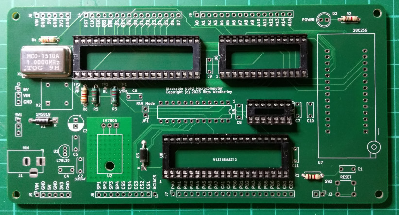

<a name="step-5"/>
Step 5: Ceramic Capacitors
--------------------------

Next up are the ceramic capacitors.  Most of them are 100nF.  Monolithic
capacitors are also fine.

* C1, C4-C11 - 100nF
* C2 - 220nF or 330nF - the datasheet for the L78L33 voltage regulator
recommends 330nF, but 220nF is also ok because C2 is in parallel with the
100nF C5: 220nF + 100uF = 320nF which is close enough.

I also fitted the reset pushbutton SW2 in this picture.  If you want a
panel-mounted reset pushbutton, you can wire it up to J3 next to SW2.

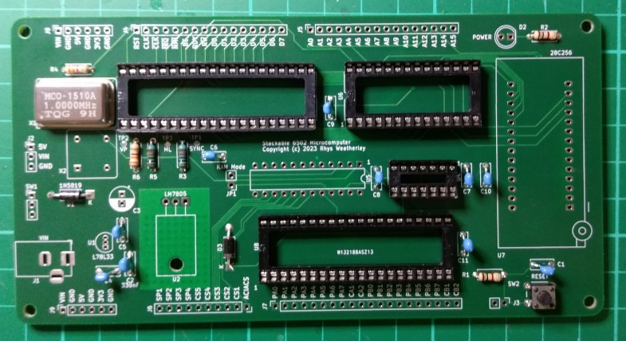

<a name="step-6"/>
Step 6: Power Supply
--------------------

The remaining components relate to the power supply for the board:

* C3 - 47uF electrolytic capacitor, 16V or better rating.
* U1 - L78L33 3.3V voltage regulator, TO-92 package.
* U2 - LM7805 5V voltage regulator, TO-220 package.
* D2 - 5mm power LED - red, green, white, blue, ... - your choice!  I chose blue.
* J1 - DC barrel jack, positive on the center pin.

These components must be oriented properly, so check the markings carefully.
I laid the 47uF capacitor on its side to clear the upper I/O board / shield.

I put a piece of thermal tape under the LM7805 to thermally bond it to
the board.  Make sure you bolt the voltage regulator down before you
solder the 3 pins.  Otherwise you might stress the package when bolting later.

The pins on the L78L33 are very close together, so you will need a fine
soldering tip.  If you mess up and bridge the pins (like I did!),
run the iron between the pins to melt the solder and create a gap.
Check the result carefully with a magnifier and multimeter to ensure
you don't have a dead short from 5V or 3.3V to ground.

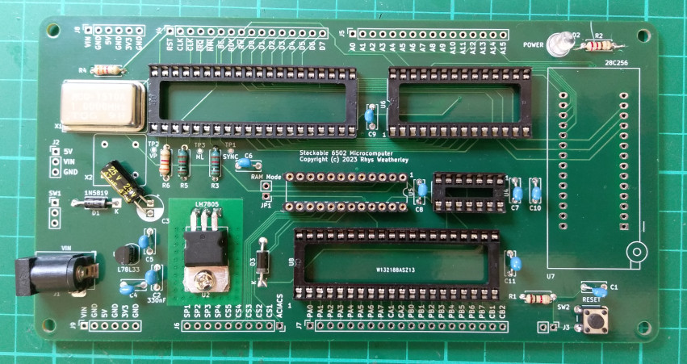

You can also see that I fitted some breakaway IC socket pins for U5 because
I didn't have a 24-pin DIP socket handy.

<a name="step-7"/>
Step 7: Smoke Test!
-------------------

Before fitting the ZIF socket or the chips, power the board on with a
9V to 12V DC plugpack (wall wart) and check that the blue smoke
doesn't escape!  If all goes well, the power LED should light up.

Check that the LM7805 and L78L33 voltage regulators don't get hot.
If they do feel hot, then there is probably a short from 5V or 3.3V to
ground somewhere.  Turn the board off and check the continuity of the
board with a multimeter.

To make testing easier, I connected a slider switch up to the SW1 pins.
Eventually I plan to have a panel-mounted switch on the enclosure.

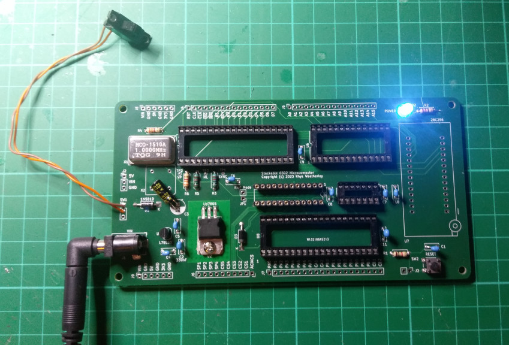

Turn the board off and then go around all pins on the chips to check
that they are connected up properly according to the schematic using a
multimeter in continuity mode.  Make sure there aren't any shorts between
the data and address lines in particular.

<a name="step-8"/>
Step 8: EEPROM Socket
---------------------

Now we can fit the 28-pin ZIF socket for the 28C256 EEPROM:

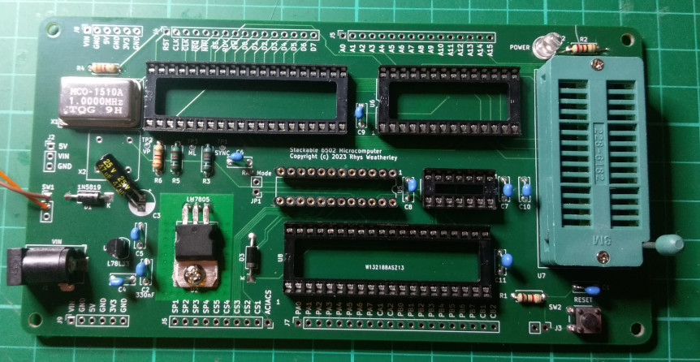

If you prefer, you can use a regular 28-pin DIP socket instead (I didn't
actually solder this - I just put it in place to show where it would go):

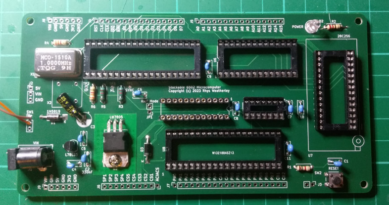

<a name="step-9"/>
Step 9: Fit the chips
---------------------

It is now time to fit the chips.  One thing I forgot was the "RAM Mode"
jumper JP1 next to U5.  It must be fitted if you are using the 74LS00
NAND gate for address decoding.  This is what the board should look
like when using the 74LS00:

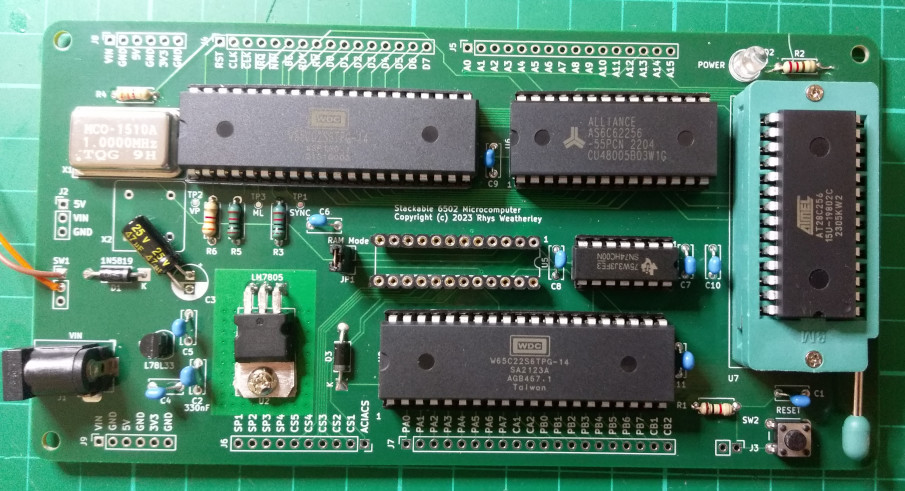

And this is what the board should look like when using the ATF22V10C-7PX
programmable logic device (PLD).  Note that the jumper on "RAM Mode" / JP1
is not fitted when using the PLD:

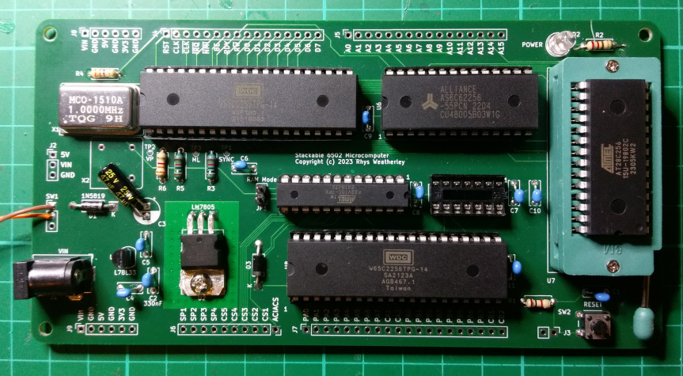

Check that the chips are oriented correctly and that there are no bent pins.
Then check the continuity of the board again to make sure that the right pins
are connected to each other.

You can do a second smoke test at this point to make sure there are
no shorts due to the chips.  The 5V and 3.3V voltage regulators should
remain cool when the power is applied.  If they get really hot, then turn
everything off and check for shorts or chips that are in backwards.

<a name="step-10"/>
Step 10: Fit the pin headers
----------------------------

Next fit the 2.54pm pin headers, such as
[these ones from Adafruit](https://www.adafruit.com/product/598).
Cut the six required headers to size:

* 2 x 6 pin headers for the voltage rails.
* 2 x 16 pin headers for address, data, and control lines.
* 1 x 10 pin header for the chip selects and spare pins.
* 1 x 20 pin header for the I/O ports on the 65C22 VIA.

When cutting the headers, score the cutting point with a hobby knife and
then snap the headers off with a pair of pliers.  The pin inserts tend to fall
out if you cut too close to the pins you want to keep.  I usually score the
cutting point close to the next pin.  You will lose one pin insert,
but you will have all the required pins in the snapped off portion.

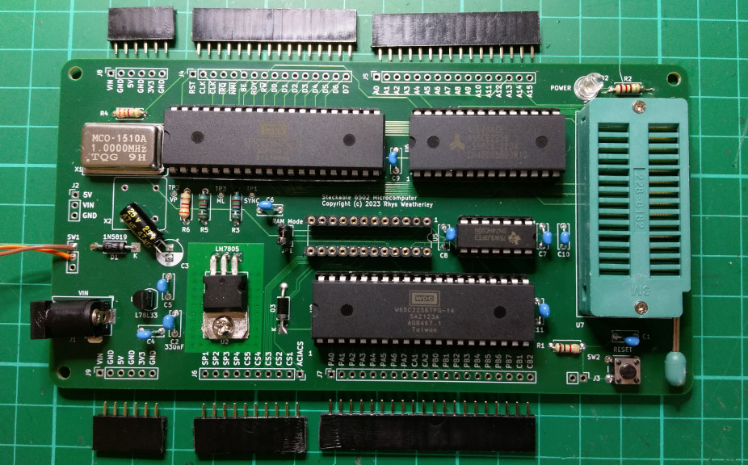

Lining up the headers for hand soldering can seem like a challenge, but it is
quite easy when you know how.  Cut the stackable headers for the I/O board,
and then threaded them through into the base board's pin headers using a
piece of protoboard:

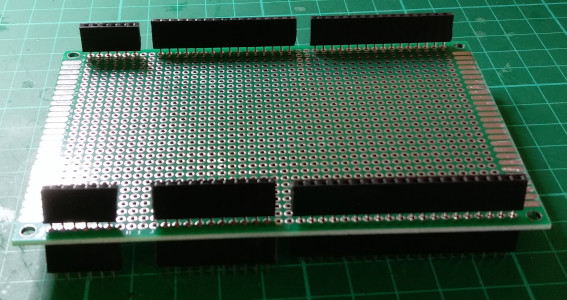

Veroboard will also work.  Or you could use the bare PCB for the I/O board
without any components on it.  You can now insert the headers into the
base board and turn the whole contraption upside down:

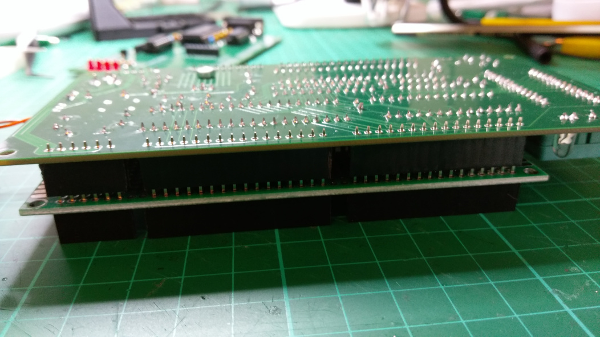

The contraption may be a little wobbly side to side because there is no
solder holding the pins rigidly in place yet.  It can be useful to clamp
the contraption between two books with flat spines.  I used some manuals
for a pair of ancient computer languages:

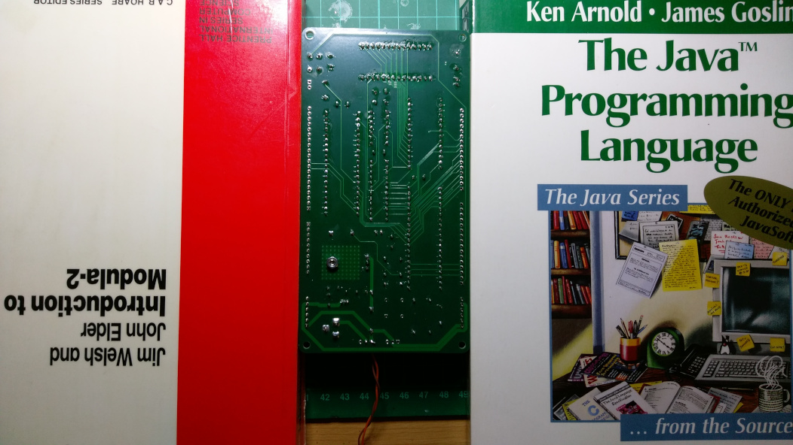

Check underneath that the pin headers are vertical and then solder 2 pins
on the ends of each header.  This will make the contraption more rigid.
You can then remove the books and solder the rest of the pins.

And here it is, all done!

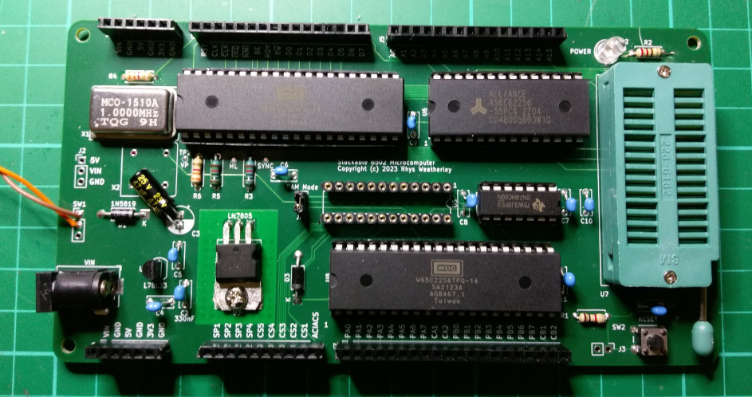

Now that the soldering of the base board is complete, you may want to give
the underside a good cleaning with isopropyl alcohol to remove the excess flux.

<a name="step-11"/>
Step 11: Testing and Troubleshooting
------------------------------------

The `roms` subdirectory in the repository contains a file called
`selftest.bin`.  Program this into an AT28C256 EEPROM and insert it
into the ROM socket (U7).  The source code is under `src/selftest`.

Connect the anodes of four LED's to PB0, PB1, PB2, and PB3.  Connect the
cathodes of the LED's through 220R or 1K resistors to ground.  If you have a
piezobuzzer, then connect it between PB7 and ground.  My setup is
shown in this picture (ignore the pushbutton and the 555 timer - they are a
permanent fixture on my breadboard):

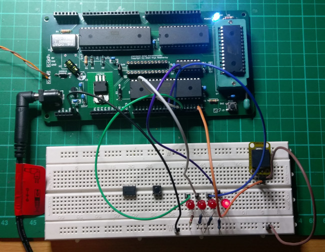

Power on the board.  Check that the LM7805 and L78L33 voltage regulators
aren't getting hot.  If they are, then there may be a short between
power and ground on the board - turn the board off and look for the short.
As mentioned above, it can be very easy to bridge the pins on the
L78L33 so I recommend checking that first.

If you have a multimeter or a bench power supply that shows the
current draw, you can use it to measure the input current.  The current
should be around 20mA to 50mA when running the self-test.

The self-test ROM starts by blinking all LED's three times and then it
runs the tests.  As each test runs, the test number is shown on the LED's
in binary.  If all tests pass, the LED's will chase back and forth
Knight Rider style in celebration.  If a test fails, the LED's will get
stuck displaying the number of the test that failed.

Here are the tests that are run.  Each test takes about 1 second when
the CPU is clocked at 1MHz:

1. Test that the stack between `$0100` and `$01FF` appears to work.
2. Test that the zero page between `$0000` and `$00FF` appears to work.
3. Write test values to all of RAM (except the stack and zero page).
4. Read the test values back from RAM and verify them.
5. Test that the BRK instruction will generate a BREAK interrupt.
6. Test that timer interrupts can be generated from the 65C22 VIA.
7. Beep the piezobuzzer on PB7 for 100ms with a 1kHz square wave.
8. Test that code can be executed from all addresses in ROM.

If a test fails, then the most likely cause is that a chip is fitted
backwards or you have bent one of the pins trying to insert the chip
into its socket.  Also make sure that you have fitted the JP1 jumper
when using the 74LS00 NAND gate for address decoding.

If no LED's light up, then there may be something wrong with the clock
signal to the CPU.  Check it with an oscilloscope on the CLK header pin.
Or use a multimeter - the average voltage should hover about half-way
between 5V and ground.

If everything passes, then you have a working Stackable 6502 Base Board!
Congratulations!  Next is the [I/O Board](Build-Io-Board.md).
