Building the I/O Board of the Stackable 6502 Computer
=====================================================

See the [Parts.md](Parts.md) file for a list of parts.  It is assumed that
you are familiar with soldering through hole parts.  There are no surface
mount parts in the I/O Board.  Sockets are recommended for the chips
as there will be a lot of handling while soldering up all the components.

The PDF of the I/O Board schematic can be found [here](../schematics/IoBoard.pdf).

The following 3D rendering from KiCad shows the location of the major
components:

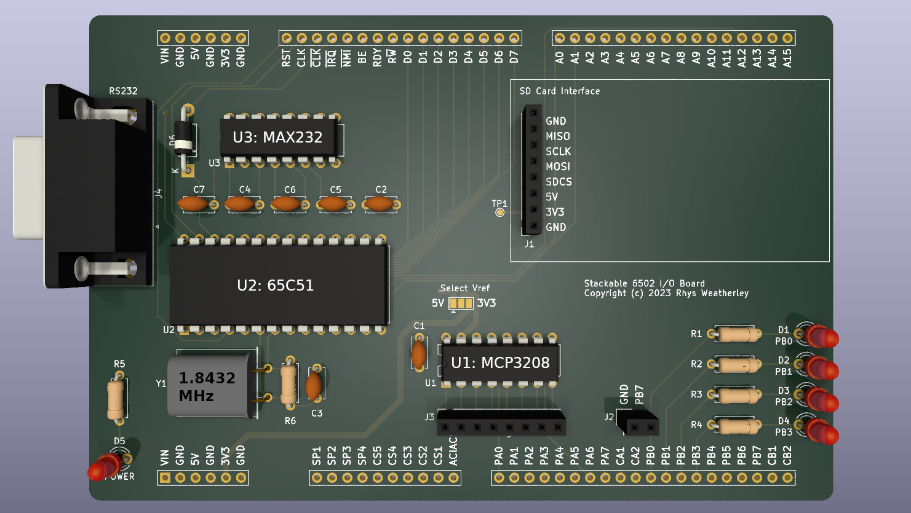

Here are all of the steps if you want to skip ahead:

* [Step 1: Resistors and Diodes](#step-1)
* [Step 2: IC Sockets](#step-2)
* [Step 3: Capacitors](#step-3)
* [Step 4: Crystal](#step-4)
* [Step 5: Indicator LED's](#step-5)
* [Step 6: Connectors](#step-6)
* [Step 7: Fit the chips](#step-7)
* [Step 8: Extra modules](#step-8)
* [Step 9: Fit the stackable headers](#step-9)
* [Step 10: Testing and Troubleshooting](#step-10)

<a name="step-1"/>

## Step 1: Resistors and Diodes

As with all through hole projects, start with the low profile components:

* R1 to R5 - 220R (see the note below)
* R6 - 1M
* D6 - Schottky diode, 1N5819 or SB140 or equivalent.  Make sure the diode
is oriented the right way around.

R1 to R2 are current-limiting resistors for the indicator and power LED's
(D1 to D5).  The value of this resistor will depend upon the current rating of
your LED.  220R is suitable for simple red/green LED's rated for 15mA to 20mA.
Increase the resistance for LED's with lower current ratings.  1K should be
safe for most LED types but it may be dim.

I didn't fit R5 and D5 in my build because I already had a power LED on
the base board.  But you can add them if you want some visual indication
that the I/O board is getting power from the base board.

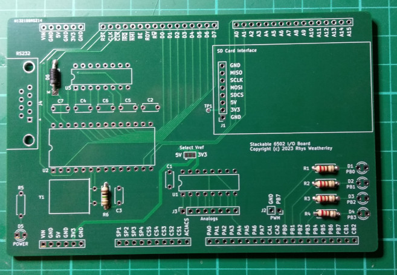

<a name="step-2"/>

## Step 2: IC Sockets

Next it is time for the IC sockets:

* U1 - 16-pin DIP socket - MCP3208 12-bit SPI ADC (optional).
* U2 - 28-pin DIP socket - 65C51 ACIA.
* U3 - 16-pin DIP socket - MAX232 RS-232 line driver.

The pin 1 notch on all chips points towards the left of the PCB.

You can solder the chips directly to the board if you want, but IC sockets
makes it easier to replace them later if they fail or to remove them when
diagnosing faults.

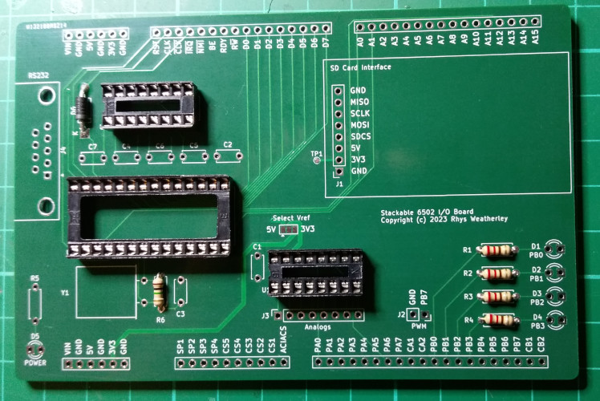

<a name="step-3"/>

## Step 3: Capacitors

Next up are the capacitors.

* C1, C2 - 100nF ceramic or monolithic capacitors.
* C3 - 22pF ceramic capacitor.  Can use 20pF or 30pF instead if you have
those instead.
* C4 - C7 - 1uF ceramic or monolithic capacitors.

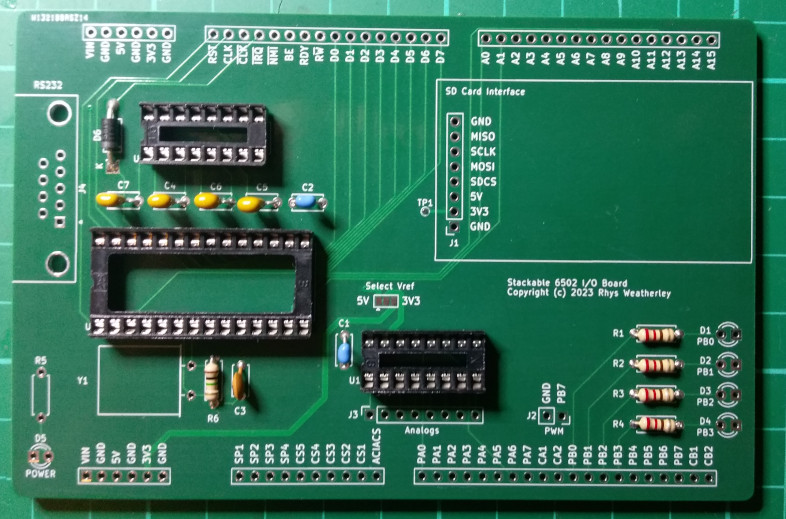

<a name="step-4"/>

## Step 4: Crystal

Next fit the 1.8432MHz crystal Y1, lying down flat on the PCB to reduce
vertical height:

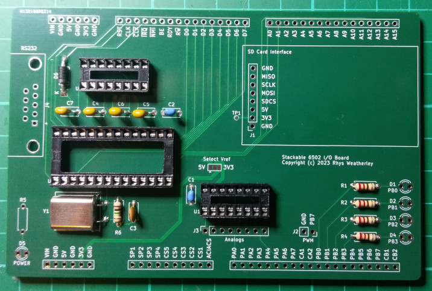

<a name="step-5"/>

## Step 5: Indicator LED's

Now fit the four indicator LED's on PB0 to PB3.  Make sure you orient
them with the cathode (flat side) toward the edge of the PCB.

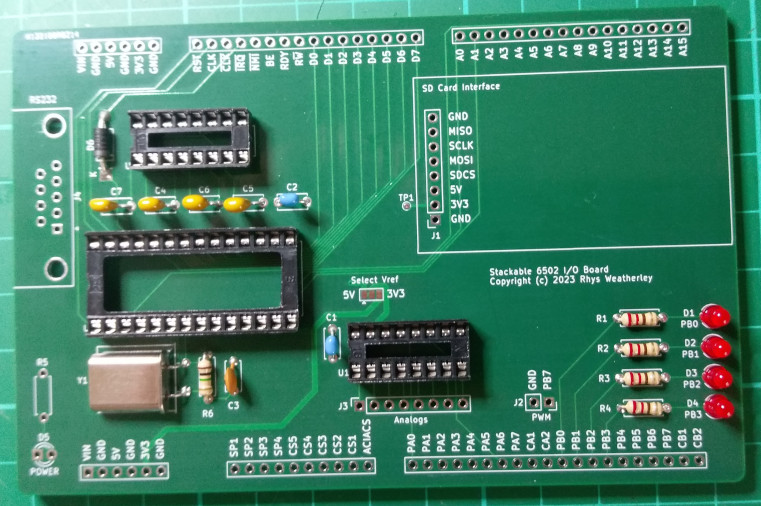

<a name="step-6"/>

## Step 6: Connectors

Fit half-height 2.54mm pin headers to J1, J2, and J3, such as
[these ones from Adafruit](https://www.adafruit.com/product/3008).
Then fit the female DB9 connector to J4.

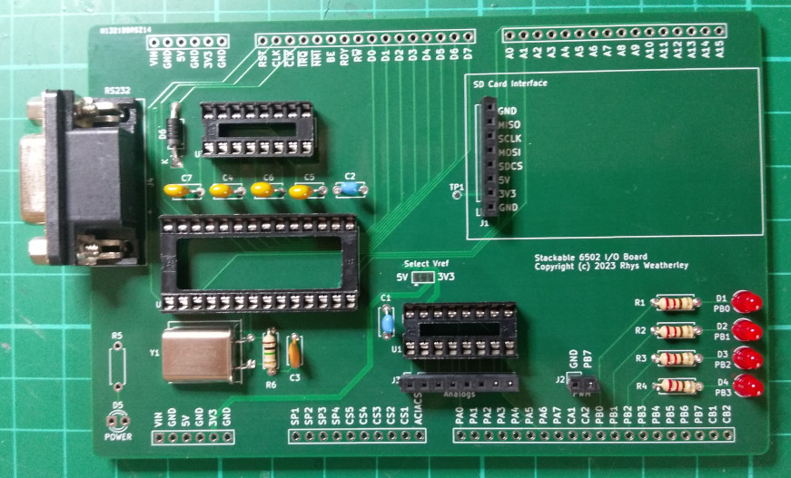

<a name="step-7"/>

## Step 7: Fit the chips

It is now time to fit the chips.  Check that the chips are oriented correctly
with pin 1 towards the left side of the PCB, and that there are no bent pins.
Then check the continuity of the board against the schematic to make sure
that the right pins are connected to each other.

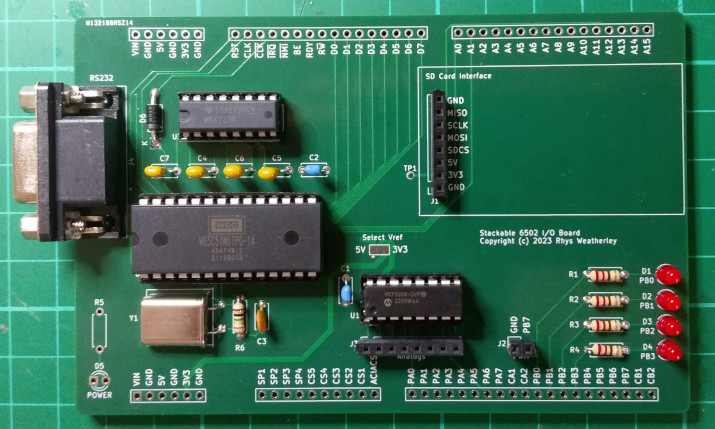

<a name="step-8"/>

## Step 8: Extra modules

J1 was designed to take a [5V Arduino SD card module](https://www.jaycar.com.au/arduino-compatible-sd-card-interface-module/p/XC4386)
that I got from Jaycar in Australia.

There are other SD card modules from Adafruit, Sparkfun, and others.
But the pinouts aren't always the same.  You may have to make an adapter to
connect them to J1.  J1 has the following pin-out:

* 1 - Ground
* 2 - 3.3V supply from the voltage regulator on the SD card module itself
* 3 - 5V supply to the SD card module
* 4 - SD card chip select (PA5 on the 65C22 VIA)
* 5 - MOSI (PA1 on the 65C22 VIA)
* 6 - SPI clock (PA0 on the 65C22 VIA)
* 7 - MISO (PA6 on the 65C22 VIA)
* 8 - Ground

5V Arduino SD card modules tend to have an on-board 3.3V supply,
which is broken out as test point TP1 on the PCB.  This is not
connected to the 3.3V supply from the base board.  But if you
didn't fit the 3.3V supply on the base board, you could use the
3.3V supply from the SD card module instead.  Run a wire from
TP1 to the 3.3V line.

J2 makes Ground and PB7 available.  I usually plug in a piezobuzzer module
for making simple sounds using the square wave output capability of
the 65C22 Versatile Interface Adaptor (VIA) on the base board.

You can see the two modules that I used in this picture:

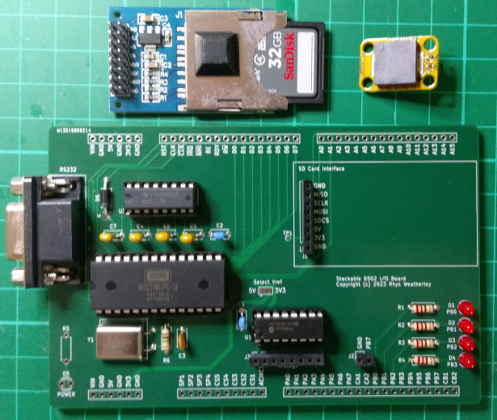

And here they are fitted to the board:

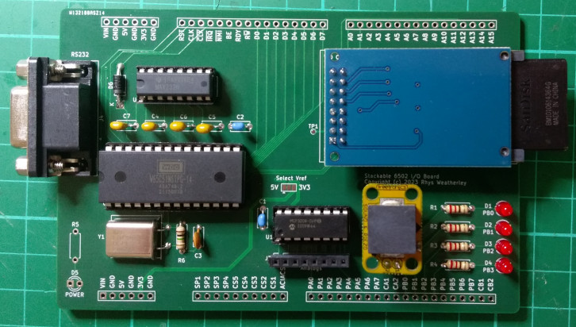

I used a stick-on rubber foot to the SD card module to support it in place:

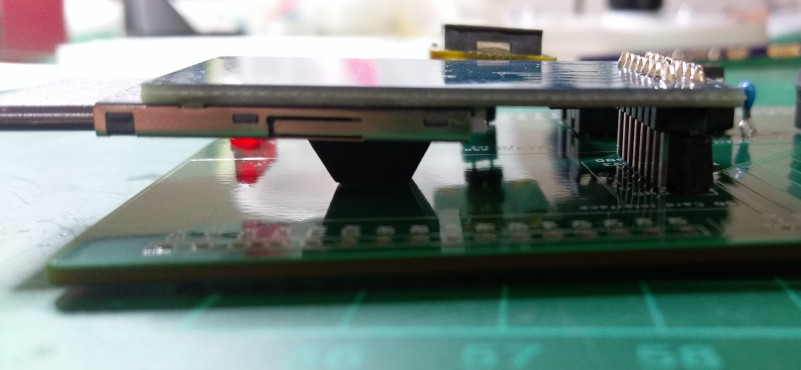

<a name="step-9"/>

## Step 9: Fit the stackable headers

Next fit the 2.54pm pin stackable headers, such as
[these ones from Adafruit](https://www.adafruit.com/product/3366).
Cut the six required headers to size:

* 2 x 6 pin headers for the voltage rails.
* 2 x 16 pin headers for address, data, and control lines.
* 1 x 10 pin header for the chip selects and spare pins.
* 1 x 20 pin header for the I/O ports on the 65C22 VIA.

When cutting the headers, score the cutting point with a hobby knife and
then snap the headers off with a pair of pliers.  The pin inserts tend to fall
out if you cut too close to the pins you want to keep.  I usually score the
cutting point close to the next pin.  You will lose one pin insert,
but you will have all the required pins in the snapped off portion.

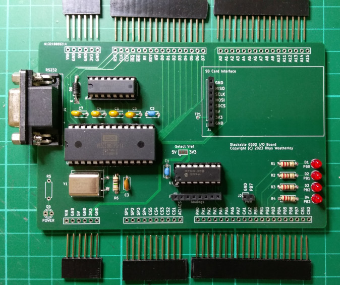

Lining up the headers for hand soldering can seem like a challenge, but it is
quite easy if you plug the I/O board into headers on the already-soldered
base board.  This will line everything up:

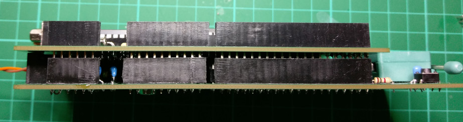

Then quickly solder two pins on each header to tack them down.  Try not to
apply too much heat or you might melt the two boards together permanently!
A small glob of solder is enough even if the joint isn't perfect.

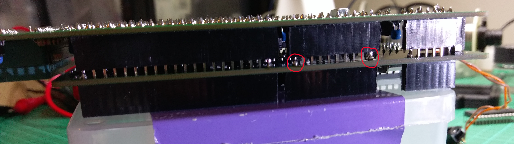

Pull the two boards apart and solder the other pins.  You should also touch
up the solder joints on the pins you have already done.  Otherwise you
might have a dry joint.

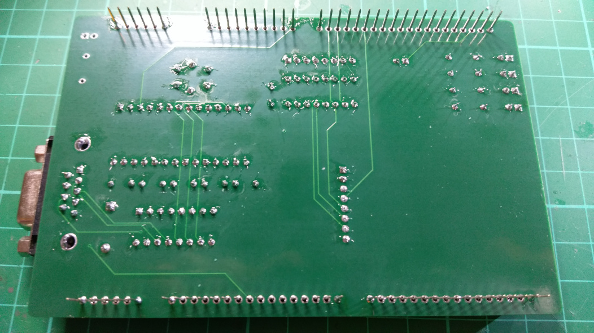

And here is the finished product, connected to the base board:

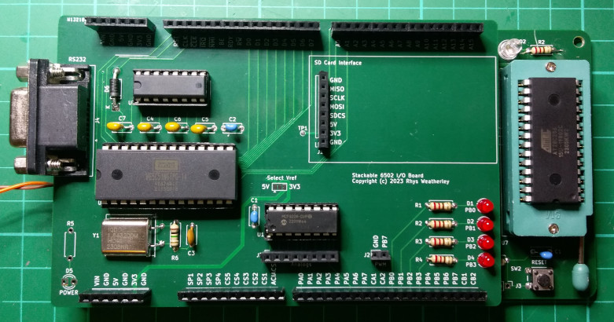

<a name="step-9"/>

## Step 10: Testing and Troubleshooting

Connect up a USB-to-serial converter to the RS232 port, and connect to
it with a terminal program configured for 19200 bps N-8-1.

Run the same selftest program as when
[Building the Base Board](Build-Base-Board.md#step-11) and troubleshoot
as described on that page.

If the 65C51 ACIA and the serial port are working, then you should
see text like the following in the terminal program:

    Self test started!
    Stack check: Running
    Stack check: Success
    Zero page check: Running
    Zero page check: Success
    RAM check: Filling memory
    RAM check: Verifying memory
    RAM check: Success
    BRK check: Running
    BRK check: Success
    Timer interrupt check: Running
    Timer interrupt check: Success
    PWM output check: Running
    PWM output check: Done
    ROM check: Running
    ROM check: Success
    All tests passed!

This tells you that serial transmit from the board is working.

Note: I sometimes have issues with my USB-to-serial converter where it
stops working on its own.  Unplugging the USB end from my desktop
computer and plugging it back in again can help.  So don't automatically
assume that the I/O board is not working.  It may be other equipment!

After you see "All tests passed!", you can type in characters and
see if they are echo'ed back to you:

    ...
    ROM check: Running
    ROM check: Success
    All tests passed!
    abcd
    878jdfkjdkfj
    It's working!

If the echo works, then serial receive is also working.  Congratulations!
You now have a working Stackable 6502 I/O Board!
